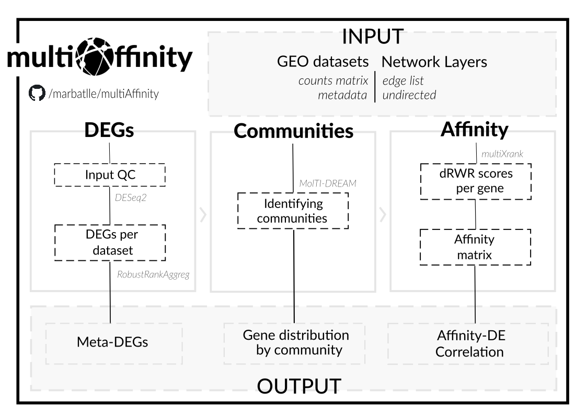
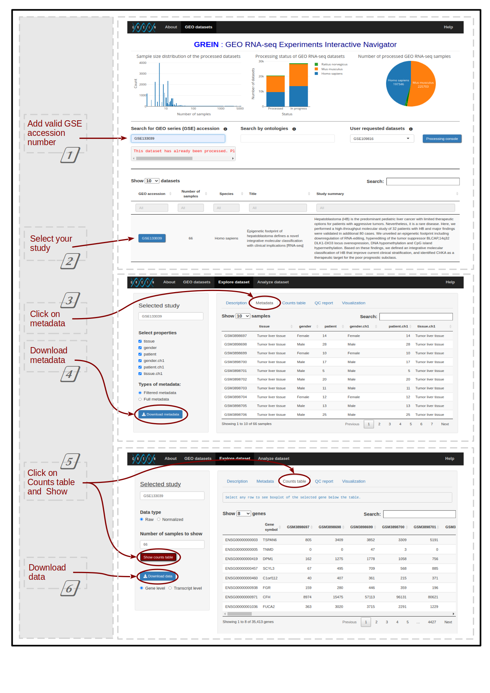

**Study the community composition and node affinity of the DEGs obtained from one or multiple RNA-Seq studies.**

## Overview
This is a schema of the complete workflow

## Input
Before running the tool, the input files need to be selected and added to your input file. These consist of:

### RNA-Seq data
This tool is designed to work seamlessly with the output created by [GREIN](http://www.ilincs.org/apps/grein/?gse=), to be more specific, the raw counts matrix and metadata table are required. 

If your dataset has not been already been processed by GREIN, please, request its processing and check its progress at the Processing Console. On the other hand, if you want to use datasets not available at GEO, make sure that your files format match these requirements:

#### Metadata:
* The files should be named following: *sampleid*_metadata.csv
* Make sure metadata labels contain the word Normal

Sample file:

    "",tissue type
    GSM2177840,Normal
    GSM2177841,Normal
    GSM2177842,Tumor
    GSM2177843,Normal

#### Counts Matrix
* The files should be named following: *sampleid*_data.csv
* Make sure counts matrix includes gene symbols.
* The series accession identifiers (GSM) should match the ones on the metadata file.

Sample file:

    "",gene_symbol,GSM2177840,GSM2177841,GSM2177842,GSM2177843
    ENSG00000000003,TSPAN6,2076,1326,457,598
    ENSG00000000005,TNMD,0,0,0,0,1
    ENSG00000000419,DPM1,321,228,56,157
    ENSG00000000457,SCYL3,236,176,118,131

And remember, counts matrix and metadata have to share the same identifier.

### Network Layers
The last input required is a gene-gene network consisting of one or multiple layers in which nodes represent genes and edges represent different types of associations. Note that each layer should be added as a separate file.

Sample file:

    CNBP HNRNPAB
    CNBP RPL10A
    CNBP CENPN
    CNBP RSL24D1
    CNBP SMAP
    CNBP FTSJ3
    CNBP TRA2B

## Usage

Execute the script:

    bash multiAffinity [-h] -c COUNTS_PATH -m METADATA_PATH -n NETWORK_PATH
                       [-a DESeq2_padj] [-b DESeq2_LFC] [-d RRA_Score]
                       [-e waddR_resolution] [-f waddR_permnum] [-g multiXrank_r]
                       [-h multiXrank_selfloops] [-i multiXrank_delta]
                       [-j Molti_modularity] [-k Molti_Louvain]

**Arguments**

    -h                          show this help message and exit
    -c COUNTS_PATH              path to counts matrix, single or multiple (-c COUNTS_PATH1,COUNTS_PATH2)
    -m METADATA_PATH            path to metadata, single or multiple (-c METADATA_PATH1,METADATA_PATH2)
    -n NETWORK_PATH             path to network, single or multiple (-c NETWORK_PATH1,NETWORK_PATH2)
    -a DESeq2_padj              optional - default value is 0.05
    -b DESeq2_LFC               optional - default value is 1
    -d RRA_Score                optional - default value is 0.05
    -e waddR_resolution         optional - default value is 0.001
    -f waddR_permnum            optional - default value is 10000
    -g multiXrank_r             optional - default value is 0.5
    -h multiXrank_selfloops     optional - default value is 0
    -i multiXrank_delta         optional - default value is 0.05
    -j Molti_modularity         optional - default value is 1
    -k Molti_Louvain            optional - default value is 0

## Pipeline steps
Here you can find a general description of the main steps of the pipeline

### 1. DEGs
Obtaining differentially expressed genes after integrating multiple GEO RNAseq datasets through a rank aggregation method.

### 2. Affinity

### 3. Communitites

## Case Study 

### Data

### Networks

* **Liver PPI layer**

    * Number of nodes: 18726
    * Number of edges: 960872

* **Metabolic layer**
    * Number of nodes: 1786
    * Number of edges: 52077

docker run -v $(pwd):/input -it marbatlle/multiaffinity ./multiAffinity -c input/GSE81928_GeneLevel_Raw_data.csv,input/GSE89775_GeneLevel_Raw_data.csv -m input/GSE81928_filtered_metadata.csv,input/GSE89775_filtered_metadata.csv -n input/metabs_layer.csv

## Output Files

## Authors

## Citations
Mahi NA, Najafabadi MF, Pilarczyk M, Kouril M, Medvedovic M. GREIN: An Interactive Web Platform for Re-analyzing GEO RNA-seq Data. Sci Rep. 2019 May 20;9(1):7580. doi: 10.1038/s41598-019-43935-8. PMID: 31110304; PMCID: PMC6527554.

Love MI, Huber W, Anders S. Moderated estimation of fold change and dispersion for RNA-seq data with DESeq2. Genome Biol. 2014;15(12):550. doi: 10.1186/s13059-014-0550-8. PMID: 25516281; PMCID: PMC4302049.

Kolde R, Laur S, Adler P, Vilo J. Robust rank aggregation for gene list integration and meta-analysis. Bioinformatics. 2012 Feb 15;28(4):573-80. doi: 10.1093/bioinformatics/btr709. Epub 2012 Jan 12. PMID: 22247279; PMCID: PMC3278763.

Didier G, Valdeolivas A, Baudot A. Identifying communities from multiplex biological networks by randomized optimization of modularity. F1000Res. 2018 Jul 10;7:1042. doi: 10.12688/f1000research.15486.2. PMID: 30210790; PMCID: PMC6107982.

docker build -t marbatlle/multiaffinity .

docker push marbatlle/multiaffinity

docker run -ti -v $(pwd):/input marbatlle/multiaffinity ./multiAffinity -h
