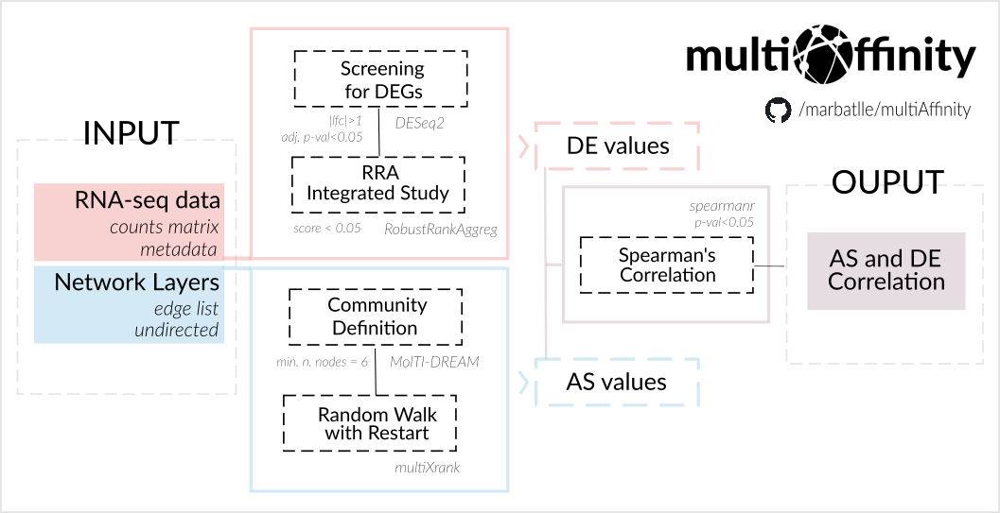

# Welcome to multiAffinity
This is the documentation for [multiAffinity](https://github.com/marbatlle/multiAffinity), which enables the study of how gene dysregulation propagates on a multilayer network on a disease of interest, uncovers the key genes. Following the approach detailed in this [video](https://www.youtube.com/watch?v=1tcwczu47aI), and the following scheme:

 

-------------------------------------------------------------------------

